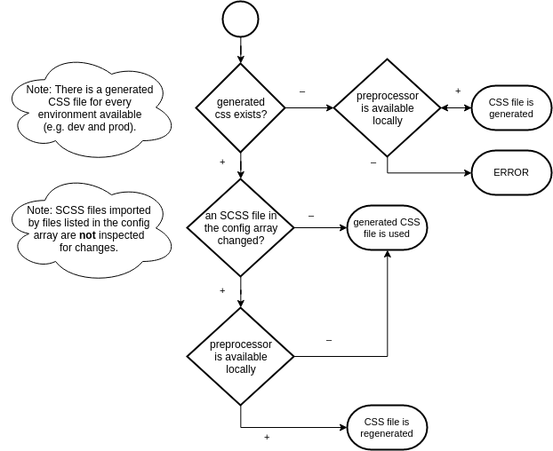

# Contao Stylesheet Manager

This module offers functionality for generating an aggregated CSS file out of different types of stylesheets in Contao (preserving access to mixins and variables from nearly every file).

## Features

- expandable architecture (new preprocessors like LESS can be added easily)
- SCSS
    - uses locally installed sass for compiling SCSS files (usually ```/usr/bin/env sass```)
- aggregating all files to a single CSS file
- support for development and production environment (including css map in dev environment and minification aka compression in production environment)
- caching of the generated CSS file so that a full regeneration is only necessary if at least one of the linked files change
- recursive watching for changes of all imported scss files
- a random string is added to the name of the generated css file to bypass browser cache

## Possible types of stylesheets

Note: the order of types is mandatory.

| Stylesheet type     | Description                                           | Supported formats                       | Overridable stylesheets |
|---------------------|-------------------------------------------------------|-----------------------------------------|-------------------------|
| core stylesheets    | e.g. bootstrap                                        | CSS, SCSS                               | –                       |
| module stylesheets  | stylesheets living in contao modules, i.e. assets/css | CSS (else contao would throw Exception) | core                    |
| project stylesheets | project specific stylesheets                          | CSS, SCSS                               | core, modules           |

Note: Even though project stylesheets are loaded *after* everything else, there's still access to all stylesheets (including variables, mixins, ... living in the core stylesheets).

## Currently supported formats

Note: This module is written in an expandable way, so new compilers can be added easily (e.g. LESS).

- CSS
- SCSS (compiled by sass which is a requirement then)

## Technical instructions

### Installation

1. Add the following code to a config.php of one of your modules (preferably some kind of module containing all the business logic of your project):

    ```
    $GLOBALS['TL_STYLESHEET_MANAGER_CSS'] = [
        'domain1' => [
            'core'    => [
                'files/themes/domain1/scss/_variables.scss', // add the project's variables in order to override variables of libs like bootstrap
                'files/themes/domain1/scss/_core.scss' // could import libs like bootstrap or font awesome
            ],
            'project' => [
                'files/themes/domain2/scss/project.scss' // could import other scss files which are also watched by default
            ],
            'skipModuleCss' => false // set to true if this domain doesn't need module CSS
        ],
        'domain2' => [
            'core'    => [
                'files/themes/domain2/scss/_variables.scss', // add the project's variables in order to override variables of libs like bootstrap
                'files/themes/domain2/scss/_core.scss' // could import libs like bootstrap or font awesome
            ],
            'project' => [
                'files/themes/domain2/scss/project.scss' // could import other scss files which are also watched by default
            ],
            'skipModuleCss' => false // set to true if this domain doesn't need module CSS
        ]
    ];
    ```

    __Important note__: Every file can import other files. These files are also watched for changes. If you don't want that (e.g. due to performance issues), you can disable this feature by setting `$GLOBALS['STYLESHEET_MANAGER']['preprocessors']['scss']['recursivelyWatchImports'] = false`.

2. Copy the contao template fe_page.html5 to your contao instance's templates directory and replace ```<?= $this->stylesheets ?>``` by ```<!-- stylesheetManagerCss.domain1 -->``` (CAUTION: including the comment characters! Adjust the name after the dot according to your domain name in ```$GLOBALS['TL_STYLESHEET_MANAGER_CSS']```).

### Configuration

Note: Take a look into ```config.php``` in order to see what properties can be adjusted.

### Commands

- clear the stylesheet manager cache: ```<contao dir>/vendor/bin/contao-console stylesheetmanager:cache:clear```

### CSS generation and caching



### Add a new preprocessor

1. Extend from Compiler (copy Scss.php if you like):

    ```
    <?php
    
    namespace Acme\MyBundle\Compiler;
    
    class Less extends Compiler
    {
        //...
    }
    ```

2. Register the new preprocessor in the config:

    ```
    <?php
    
    // Acme\MyBundle\Resources/contao/config.php
    
    $GLOBALS['STYLESHEET_MANAGER']['preprocessors']['less'] = [
        'class'                   => '\Acme\MyBundle\Compiler\Less',
        'bin'                     => '/usr/bin/less',
        'cmdDev'                  => '##lib## ...',
        'cmdProd'                 => '##lib## ...',
        'recursivelyWatchImports' => true
    ];
    ```

3. Activate the new preprocessor:
    
    ```
    $GLOBALS['STYLESHEET_MANAGER']['activePreprocessor'] = 'less';
    ```

### Hooks

Name | Arguments | Description
---- | --------- | -----------
modifyFrontendPage | $strBuffer, $strTemplate | Triggers the compiling.

## TODO

- support for contao's tags "static", "media", ... in asset paths added to the according arrays in ```$GLOBALS```